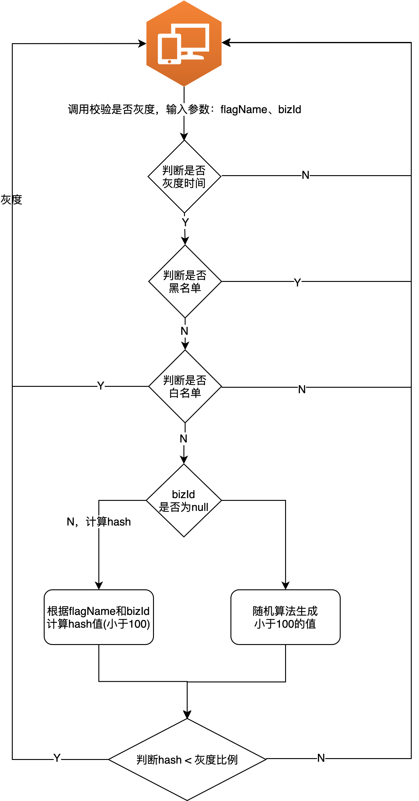

# Feature Flag

## 1、为什么需要Feature Flag

> Feature Flag(又名 Feature Toggle、Flip等)是一种允许控制线上功能开启或者关闭的方式，通常会采取配置文件的方式来控制。

**引入Feature Flag有以下优势：**

- 增强持续部署的信心；
- A/B testing 支持；
- 特性开放范围控制，有效验证线上新特性功能，针对特定人群发布功能尽早获得反馈，减少线上问题影响范围；
- 可作为限流、降级之外有效的应急预案；
- 能线上开启或者关闭,实现快速回滚。

## 2、Feature Flag技术实现

### 2.1 框架设计图


### 2.2 灰度算法

详见[Feature Flag灰度算法](docs/algorithm.md)

### 2.3 灰度判断逻辑



## 3、使用说明

对于接入方，需要完成Apollo、代码接入2个步骤才能最终用上Feature Flag。具体如下：

### 3.1 Apollo配置

一个完整的Feature Flag配置如下：
```properties
# 灰度开关描述
flags.enable-open-search.desc=控制是否开启开放搜索
# 灰度开始时间，留空默认不限制开始时间
flags.enable-open-search.startTime=2021-06-12 01:02:03
# 灰度结束时间，留空默认不限制开始时间
flags.enable-open-search.endTime=
# 灰度白名单，允许为空
flags.enable-open-search.whiteList=u1,u2,u3
# 灰度黑名单，允许为空
flags.enable-open-search.blackList=
# 灰度比例
flags.enable-open-search.launchPercent=95
```

### 3.2 项目引入

#### 3.2.1 `pom.xml`引入依赖
```xml
<dependency>
    <groupId>cn.zzq0324</groupId>
    <artifactId>feature-flag</artifactId>
    <version>1.0.0-SNAPSHOT</version>
</dependency>
```

#### 3.2.2 代码调用

* **场景一：同个业务id严格控制每次执行结果一致**
    ```java
    FeatureFlagHelper.isFeatureOn("$flagName", "$bizId");
    ```

* **场景二：控制流量整体趋势符合灰度比例，同个业务id执行结果不要求强一致**
    ```java
    FeatureFlagHelper.isFeatureOn("$flagName");
    ```

## 4、命名规范和管理流程

### 4.1 命名规范

flag名称尽量以`enable-`开头，例如`enable-open-search`。

### 4.2 Feature Flag声明周期


## 5、参考资料

* [为什么Java String哈希乘数为3？](https://mp.weixin.qq.com/s/sCWQGU_OWiQkDUuSPXvw-w)
* [FNV哈希算法](https://blog.csdn.net/hustfoxy/article/details/23687239)
* [JavaFNV](https://github.com/Killeroid/JavaFNV)
* [Fowler–Noll–Vo hash function](https://en.wikipedia.org/wiki/Fowler%E2%80%93Noll%E2%80%93Vo_hash_function)